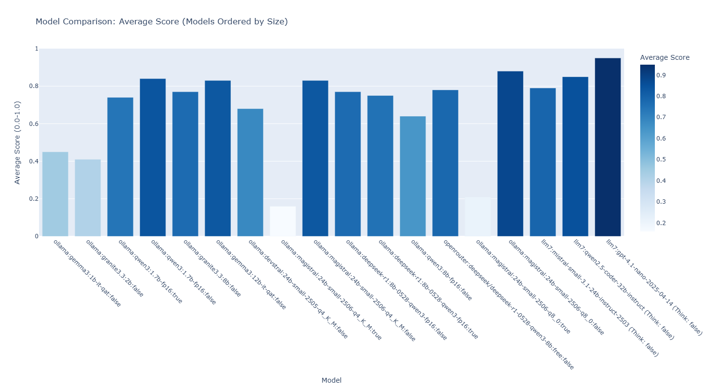

# Poor Bench

`poor_bench` is a Python-based benchmarking framework designed to create, manage, and evaluate tests for Large Language Models (LLMs). It allows developers to define test classes with customizable prompt templates, generate tests across multiple difficulty levels, and evaluate results using modular evaluation components. The framework supports tailored prompts per LLM, initial test validation, and bulk test execution, with results scored on a 0.0 to 1.0 scale. Optimized for constrained systems, it operates as a standalone module within the `poor_ai` ecosystem, focusing on catching potential LLM issues early in development.

## Features
- Customizable test classes with prompt templates and evaluation modules.
- Support for multiple LLMs with provider-specific configurations.
- Interactive dashboard for visualizing and analyzing benchmark results.
- Lightweight, console-based solution with JSON and YAML configuration files.

## Installation

1. **Python Version**: Ensure you have Python 3.9 or higher installed.
2. **Dependencies**: Install required packages using:
   ```
   pip install pyyaml matplotlib numpy pandas pytest requests dash plotly
   ```
3. **Development Tools**: Use `pytest` for testing, `black` for formatting, and `pylint` for linting.

## Project Structure
```
poor_ai/
├── poor_bench/
│   ├── __init__.py
│   ├── main.py
│   ├── config_manager.py
│   ├── test_runner.py
│   ├── report_generator.py
│   ├── llm_manager.py
│   ├── evaluators/
│   │   ├── __init__.py
│   │   ├── math_evaluator.py
│   │   ├── sentiment_evaluator.py
│   │   └── python_evaluator.py
│   ├── test_classes.yaml
│   ├── tests.json
│   ├── llms.json
│   └── results.json
├── dashboard.py
└── images/
    └── llm_scores.png
```

## Usage

### Running Tests
Use the command-line interface provided by `main.py` to run tests, generate reports, and list configurations:
```
python poor_bench/main.py
```

### Dashboard
The `dashboard.py` script provides an interactive interface to visualize LLM benchmark results. Built with Dash and Plotly, it includes:
- Model selection dropdown.
- Score visualization with bar charts.
- Test results table with pagination.
- Model comparison table with sorting.
- Issue detection and refresh functionality.

To run the dashboard:
```
python dashboard.py
```
Access it at `http://127.0.0.1:8050`. The dashboard loads data from `results.json` and `llms.json`, displaying a chart of test scores (see `images/llm_scores.png` for an example).

## Configuration
- **Test Classes**: Defined in `test_classes.yaml`.
- **Test Instances**: Defined in `tests.json`.
- **LLM Configurations**: Defined in `llms.json`.
- **Results**: Stored in `results.json`.

## Visualization
Check out the sample model comparison chart:


## Contributing
Contributions are welcome! Please ensure code is formatted with `black` and passes `pylint` checks. Submit pull requests with detailed descriptions.

## License
[Insert license here, e.g., MIT License]